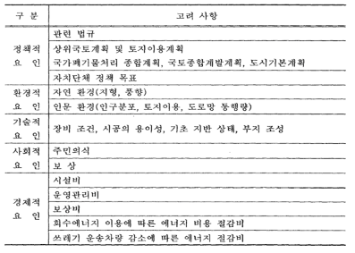
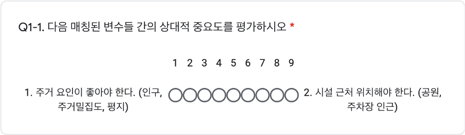
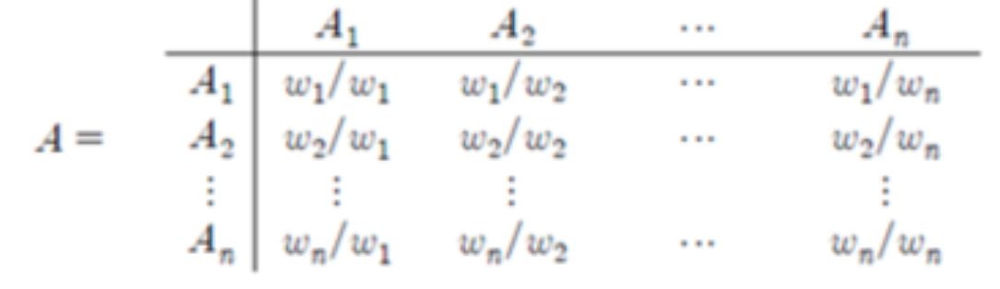
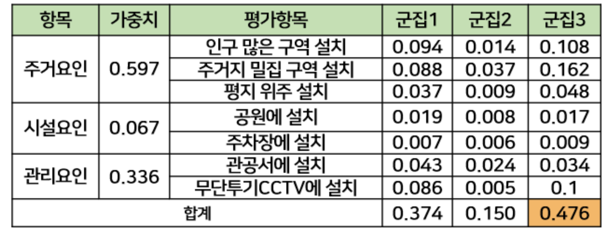

# 불연성쓰레기(non-combustible waste)

## 불연성쓰레기란?
일반폐기물 가운데 도자기, 유리, 패류 껍데기, 뼈다귀, 고양이 배변모래 등 불에 타지 않아 소각할 수 없는 쓰레기
## 프로젝트 목적
부산시 주택가 불연성쓰레기 수거함 도입을 위한 현황 조사 및 최적 입지 분석
## 프로젝트 계획 이유
- 산발적인 전용 마대 판매처
- 배출 방법에 대한 시민들의 낮은 인식
- 판매처별로 상이한 마대 규격(5ℓ~75ℓ)
- 소량 배출에도 비용 · 용량에 대한 부담, 일반 종량제 혼합배출로 이어짐
- 부산시 정책은 ‘100세대 이상 공동주택’에 한정, 주택가 수거함 부재
- 문전수거로 인한 수거원의 업무 과중
- 2단계 폐기 과정에 따른 추가 비용 발생
- 혼합배출에 따른 소각시설 잦은 고장 및 효율성 저하

## 분석 프로세스
---
### 데이터 수집 및 전처리
- 불연성쓰레기 수거함 도입에 있어 현황, 접근성, 관리성 요인으로 확인
    - 현황 확인: 구군별 불연성쓰레기 배출량 데이터 수집·정제
    - 접근성 요인: 인구, 주택, 경사도 데이터 수집·정제, 사용가능한 데이터 셋 준비
    - 관리성 요인: 수거함 관리 방식을 고려하여 관공서, 무단투기cctv 현황 데이터 수집·정제
### 데이터 분석 및 모델링
- 현황, 접근성, 관리성으로  나눈 데이터를 선형회귀 분석을 통해 군집 요인 및 입지 요인으로 나누어 유의미한 요인 선별

|구분|요인|
|:------:|:------|
|군집요인|불연성쓰레기 배출량, 대중교통 수, 면적대비 주택수|
|입지요인(주거요인)|인구많은 구역, 주거지 밀집 구역, 완경사 및 평지|
|입지요인(시설요인)|공원, 주차장|
|입지요인(관리요인)|관공서, 무단투기cctv 설치 구역|

- 선별된 군집 요인을 계층적 군집 분석을 통해 부산시 16개 구군 군집화
- 막대그래프로 형성된 군집별 특성 파악
- 신뢰성있는 전문가 의견을 바탕으로 AHP 분석, 입지 요인과 군집 요인의 세부 가중치 산출, 최종 입지 군집 선정

#### 군집 요인 선정
- 선형회귀 분석을 통해 불연성쓰레기 배출량과 인구의 상관관꼐를 도출
- 인구는 군집으로 분류될 수 있기 떄문에 인구와 밀접한 요인들을 선형회귀 분석하여 군집 요인 도출
--> 불연성쓰레기 배출량, 대중교통 수, 주택수
#### 입지 요인 선정
<center>

</center>

> 강명지, 'GIS를 이용한 쓰레기 소각장 입지 선정에 관한 연구' 참고
- 주거요인
    - 불연성쓰레기 배출량과 선형회귀 분석을 통해 상관관계 도출
    - **인구가 많은 지역, 주거지 밀집 구역, 완경사 및 평지 구역**
- 시설요인
    - 논문의 환경적 요인의 '인문 환경의 토지 이용 속성'과 기술적 요인의 '기초 지반 상태 및 부지 조성 속성'을 인용, 요인선정
    - 공원: 쓰레기 배출에 용이하고 수거함 설치 편리(기술적 요인 - 편리성 측면)
    - 공영 주차장: 단독 주택 밀집 구역에 가까운 공영 주차장(환경적 요인 - 접근성 측면)
- 관리 요인
    - 논문의 사회적 요인의 '주민의식 속성'과 경제적 요인의 '시설비 및 운영관리비 속성'을 인용, 요인설정
    - 관공서 및 무단투기 cctv 설치 구역: 수거함 관리 용이(사회적 요인, 경제적 요인 - 관리성 측면)

#### 계층적 군집 분석(Hierarchical Clustering)
- 구군별 데이터로 유사한 특성을 갖는 군집 형성 과정 파악
- *single*, *complete*, *average*, *centroid*, *ward* 중 *complete* 방법으로 부산시 16개 구군을 세 군집으로 군집화(*complete*: 군집 요소들 간 거리 중 가장 큰 수치를 군집 간 거리로 설정)

<center>

</center>

#### 군집 수 선정
Dendrogram(계층도)를 참고하여 총 16개 구군을 3개의 군집으로 선정
<center>

</center>


#### 군집별 특성 분석
- 계층적 군집 분석으로 나눈 세 가지 군집을 막대그래프를 활용해, 군집별 유사성 파악
    - 군집 1(불연성쓰레기 배출량이 많은 군집):진구, 동래구, 남구, 북구, 해운대구, 사하구, 금정구, 사상구
    - 군집 2(유동인구가 많은 군집): 강서구, 기장군
    - 군집 3(면적 대비 주택수가 많은 군집): 서구, 중구, 동구, 영도구, 연제구, 수영구

<center>

</center>

#### 계층적 분석 과정(AHP: Analytic Hierarchy Process)
AHP분석이란, ***평가기준이 다수인 문제 상황에서 이원(쌍대)비교를 통해 선호도를 비교하여 정량적 · 정성적 요소 평가***
- AHP 설문 구성

- AHP 연산 과정
대상을 A, 각각의 가중치를 W로 정의하고 n개의 대상간 이원(쌍대)비교행렬로 표현
이원(쌍대)비교행렬로 부터 *Eigenvalue Method*를 거쳐 특정 기준 하에서 대안들의 상대적 선호도의 기준들의 가중치 도출

```math
\sum_{i=1}^n \lambda_i = tr(A) \equiv \text{sum of the diagonal elements = n}\;\lambda_i \text{는 eigenvalue of}\;A
```
- 판단의 일관성 측정
Λmax(Max Eigenvalue)가 *n*에 어느정도 근접했는지 알 수 있는 척도를 통해 일관성지수(*CI*) 추출 후, 평균 무작위지수(*CR*) 추출
```math
CI = \frac{\Lambda max - n}{n - 1}\quad CR = \frac{CI}{RI} 
```
- 가중치 도출 결과

신뢰성 있는 전문가들의 AHP 설문 결과를 바탕으로 일관성 비율(CR < 0.2) 만족시키는 설문 5건에 한해 가중치 도출
(CR이 0.2미만이면 가용범위의 일관도라고 판단)

#### 선정 결과
- 1순위 - 0.476(최종 가중치)
**군집 3**: 면적대비 주택수가 많은 군집
    - 서구, 중구, 동구, 영도구, 연제구, 수영구

- 2순위 - 0.374
**군집 1**: 불연성쓰레기 배출량이 많은 군집
    - 진구, 동래구, 남구, 북구, 해운대구, 사하구, 금정구, 사상구

- 3순위 - 0.150
**군집 2**: 유동인구가 많은 군집
    - 강서구, 기장군

